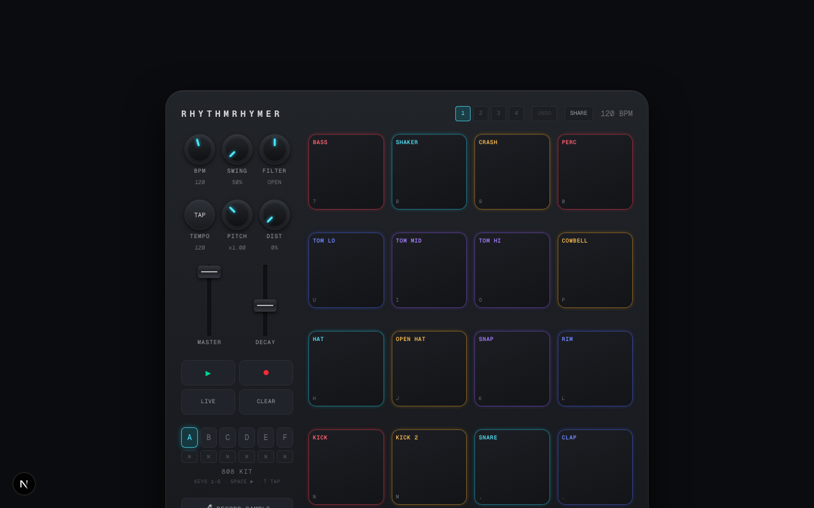

# rhythmrhymer

**Live:** https://rhythmrhymer.100dayaichallenge.com

A drum machine in your browser, styled after a Donner StarryPad MIDI pad controller. Finger-drum on 16 glowing pads, program looping beats in a step sequencer, layer six instrument banks, sample your own voice onto pads, perform with filter sweeps and note repeat, then record your track and share it as a link. Every sound is synthesized live with the Web Audio API — no samples, no backend, zero runtime dependencies.

Day 9 of a 100-day challenge: one new AI-built app per day.

## Features

- **16-pad finger drumming** — tap, click, or play the keyboard (`7890 / UIOP / HJKL / NM,.` mirrors the pad grid). Press and hold a pad for BPM-synced note repeat rolls.
- **6 instrument banks** (keys `1–6`): 808, acoustic, synth, FX (lasers, risers, vinyl stops), electro (acid bass, FM stabs, wobbles), and a playable pentatonic lead synth.
- **Layered step sequencer** — each bank has its own 16-step pattern and they all loop together. Build a beat on the 808 bank, stack melodies and FX on top. Pads glow steady when looped, flash when triggered.
- **4 scenes per project** — song sections (verse/chorus/drop) with quantized switching: queue a scene mid-bar (`Shift+1–4`) and it engages exactly on the downbeat.
- **Live loop recording** — arm LIVE (with a 4-click count-in and metronome) and play; your taps quantize to the grid and become part of the loop.
- **Sound shaping** — per-pad pitch, decay, and distortion; master volume; swing (50–75%); a DJ-style bipolar filter knob (low-pass ↔ high-pass) for sweeps and drops; tap tempo (`T`).
- **Voice sampling** — record your mic onto any pad; available pads pulse green for assignment. Sampled sounds sequence, pitch-shift, and distort like any other.
- **Per-layer mutes** — drop the kick out, slam it back in.
- **Record & export** — capture your performance off the master bus and download it as an audio file.
- **Projects, undo, sharing** — 4 save slots (auto-persisted locally), 30-level pattern undo (`Cmd/Ctrl+Z`), and SHARE compresses your whole project into a URL. Opening a shared link never overwrites local beats without an explicit, confirmed choice.

## Screenshot



## Install

```bash
git clone https://github.com/Still-InFrame/day-09-rhythmrhymer.git
cd day-09-rhythmrhymer
npm install
npm run dev
```

Then open http://localhost:3000 and hit some pads.

## Stack

Next.js 16 (App Router) · React 19 · TypeScript · Tailwind CSS v4 · Web Audio API. All drum sounds are synthesized at trigger time (oscillators, noise, filters, FM) — the repo ships no audio assets and the app works offline once loaded.

Part of the [100 Day AI Build Challenge](https://www.100dayaichallenge.com/share/savion).
